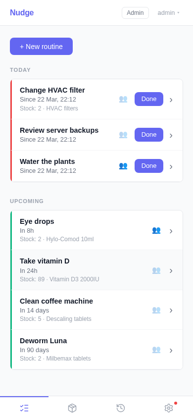
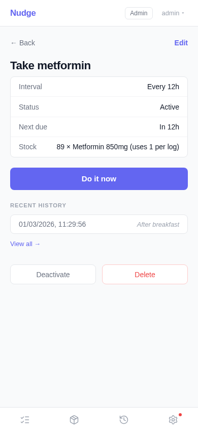
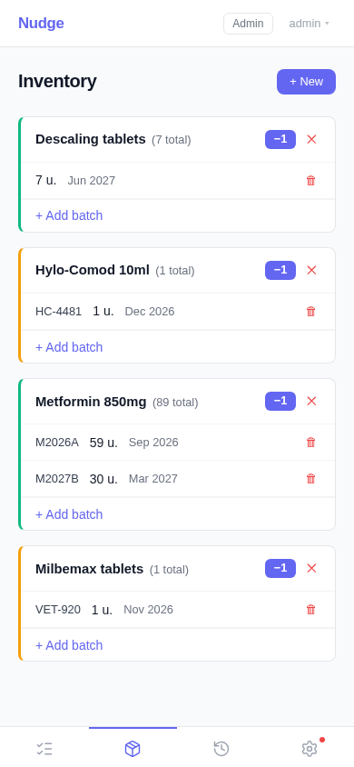
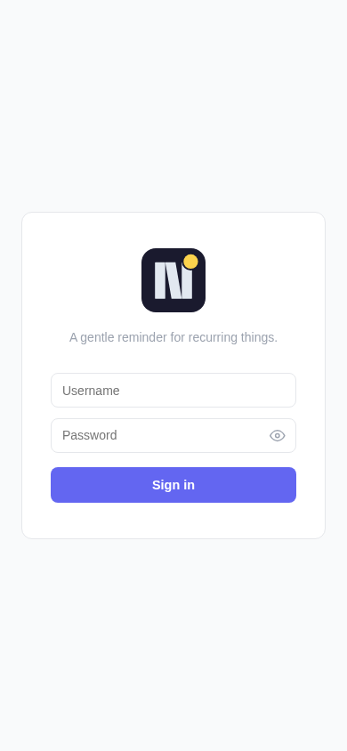
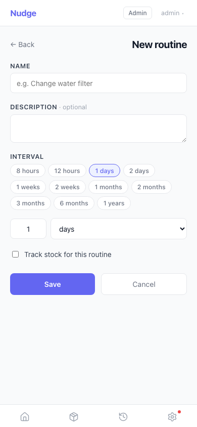
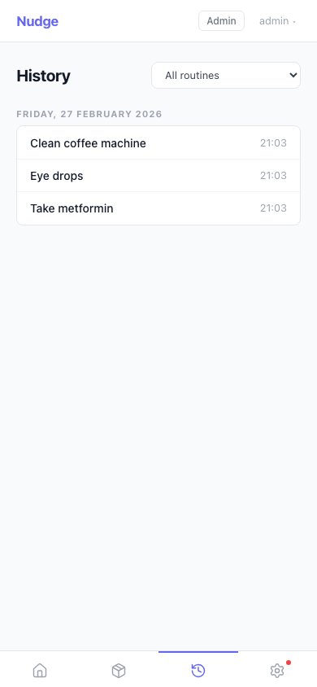
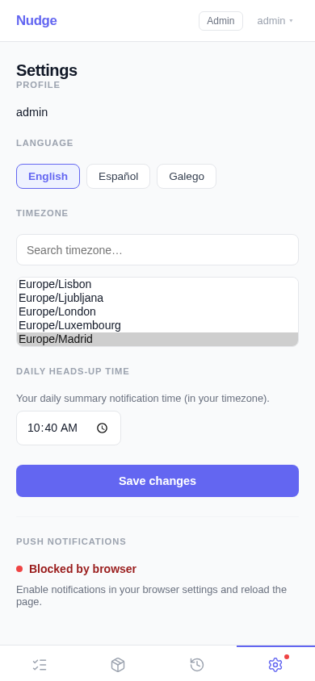

# Nudge


[](https://github.com/cibrandocampo/nudge)
[](https://hub.docker.com/r/cibrandocampo/nudge-backend)
[](https://hub.docker.com/r/cibrandocampo/nudge-frontend)
[](https://github.com/cibrandocampo/nudge/releases)
[](https://github.com/cibrandocampo/nudge/actions/workflows/ci.yml)
[](https://www.python.org/)
[](https://www.djangoproject.com/)
[](https://react.dev/)
[](https://vitejs.dev/)
[](https://codecov.io/gh/cibrandocampo/nudge)

> A gentle reminder for recurring things.

Nudge is a personal PWA that sends you a quiet push notification when something you do regularly is due again — without you having to think about it.

<p align="center">
  
  &nbsp;&nbsp;
  
  &nbsp;&nbsp;
  
</p>

---

## What problem does it solve?

Most of us have recurring tasks that are easy to forget, not because they are complicated, but because the interval between them is too long to keep in mind, and too short to leave a mark on a calendar. Nudge keeps track of that gap for you.

You define the task once, tell it how often it should happen, and then you just live your life. When it is time, it nudges you.

---

## Examples

### Medical & health

| What | Interval |
|------|----------|
| Take metformin | Every 12 hours |
| Eye drops (keratoconus) | Every 4 hours |
| Vitamin D supplement | Every 24 hours |
| Blood pressure check | Every 3 days |
| Change wound dressing | Every 2 days |
| Monthly self-exam | Every 30 days |

### Home & maintenance

| What | Interval |
|------|----------|
| Change the fryer oil | Every 10 uses → every 2 weeks |
| Water the cacti | Every 5 days |
| Water the ferns | Every 2 days |
| Clean the coffee machine | Every 7 days |
| Replace the Brita filter | Every 30 days |
| HVAC filter | Every 90 days |
| Defrost the freezer | Every 60 days |

### Pets & plants

| What | Interval |
|------|----------|
| Deworm the cat | Every 90 days |
| Flea/tick treatment | Every 30 days |
| Fertilise the plants | Every 14 days |
| Prune the lemon tree | Every 180 days |

### Work & admin

| What | Interval |
|------|----------|
| Rotate API keys | Every 90 days |
| Review server backups | Every 7 days |
| Pay quarterly taxes | Every 90 days |

The point is simple: anything you do on a schedule, Nudge can track.

---

## Features

- **Push notifications** — Browser web push when something comes due. No app store required.
- **Three-stage alerts** — A daily heads-up at your chosen time, a due alert when the interval expires, and follow-up reminders every 8 hours until you mark it done.
- **Inventory tracking** — Optionally attach a consumable to a routine (medication packs, filter cartridges, oil bottles). Each time you log the task, stock decrements automatically using FEFO order (First Expired, First Out).
- **Expiry tracking** — Add lot numbers and expiry dates to your stock. Nudge warns you 90 days before anything expires.
- **Timezone-aware** — Your notification schedule follows your local time and adjusts automatically for daylight saving.
- **Multilingual** — English, Spanish, and Galician.
- **Installable PWA** — Works offline, installs to your home screen on iOS and Android.
- **Multi-user** — Accounts are managed by an admin. There is no public registration, keeping the instance clean.

---

## Screenshots

<table>
  <tr>
    <td align="center"><br/><b>Login</b></td>
    <td align="center"><br/><b>Dashboard</b></td>
    <td align="center"><br/><b>Routine detail</b></td>
  </tr>
  <tr>
    <td align="center"><br/><b>New routine</b></td>
    <td align="center"><br/><b>Inventory</b></td>
    <td align="center"><br/><b>History</b></td>
  </tr>
  <tr>
    <td colspan="3" align="center"><br/><b>Settings</b></td>
  </tr>
</table>

---

## Quick start (self-hosted)

### Requirements

- Docker and Docker Compose
- Port 80 available (HTTPS is handled upstream by your reverse proxy / NAS DSM)

### 1. Configure environment

```bash
cp .env.example .env
# Fill in the values — see comments inside .env.example
```

Key variables:

| Variable | How to generate |
|----------|-----------------|
| `DJANGO_SECRET_KEY` | `python -c "from django.core.management.utils import get_random_secret_key; print(get_random_secret_key())"` |
| `POSTGRES_PASSWORD` | Any strong password |
| `ADMIN_PASSWORD` | Password for the default admin account |
| `VAPID_PRIVATE_KEY` / `VAPID_PUBLIC_KEY` | `pip install py-vapid && vapid --gen` |

### 2. Start

```bash
mkdir -p data
docker compose up -d
```

On first boot, database migrations run automatically and the admin account is created from `ADMIN_USERNAME` / `ADMIN_EMAIL` / `ADMIN_PASSWORD`.

The app is available at `http://localhost` (or your configured domain).

### 3. Add users

Open the Django admin panel at `/nudge-admin/` and create accounts for anyone who should have access.

---

## Development

See [dev/README.md](dev/README.md) for the full development setup, including how to run tests, linters, and install the pre-commit hook.

---

## Documentation

- [Architecture & technical design](docs/ARCHITECTURE.md)
- [Development setup](dev/README.md)
- [Backup & restore](docs/backup.md)
- [Troubleshooting](docs/troubleshooting.md)

---

## Docker images

Pre-built multi-arch images (linux/amd64 + linux/arm64) are published to Docker Hub on every push to `main` and on each release.

| Image | Tag | When |
|-------|-----|------|
| `cibrandocampo/nudge-backend` | `latest` | Every push to main |
| `cibrandocampo/nudge-frontend` | `latest` | Every push to main |
| Both | `stable` + `vX.Y.Z` | On GitHub release |

Images are also rebuilt weekly to pick up base-image and dependency security patches.
